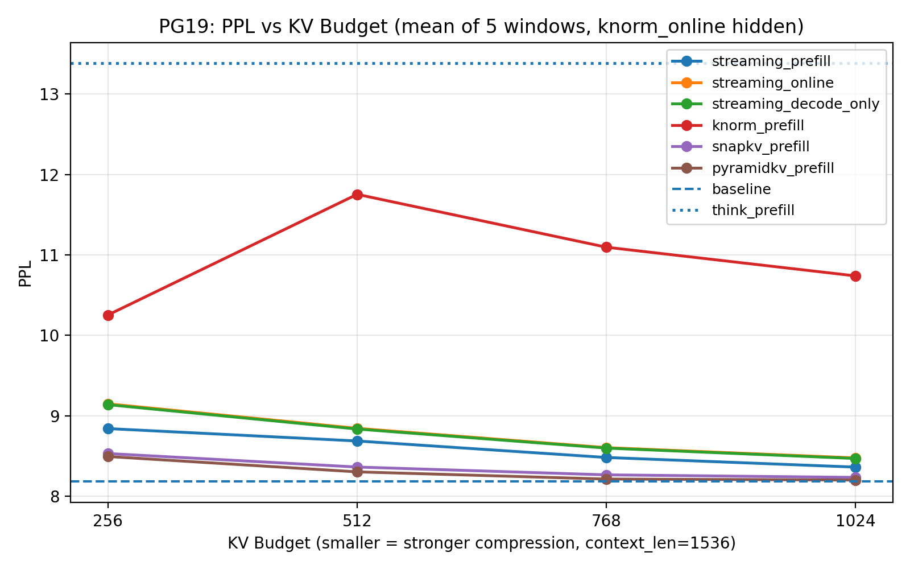
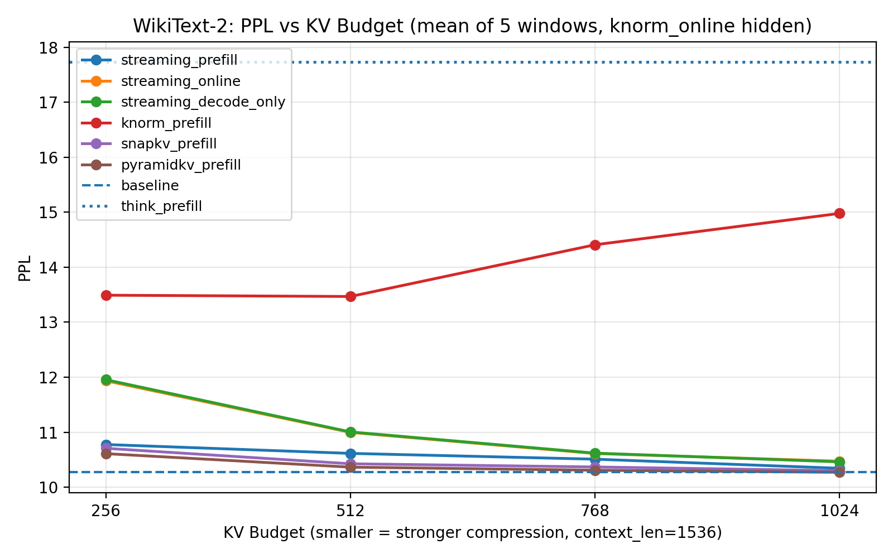
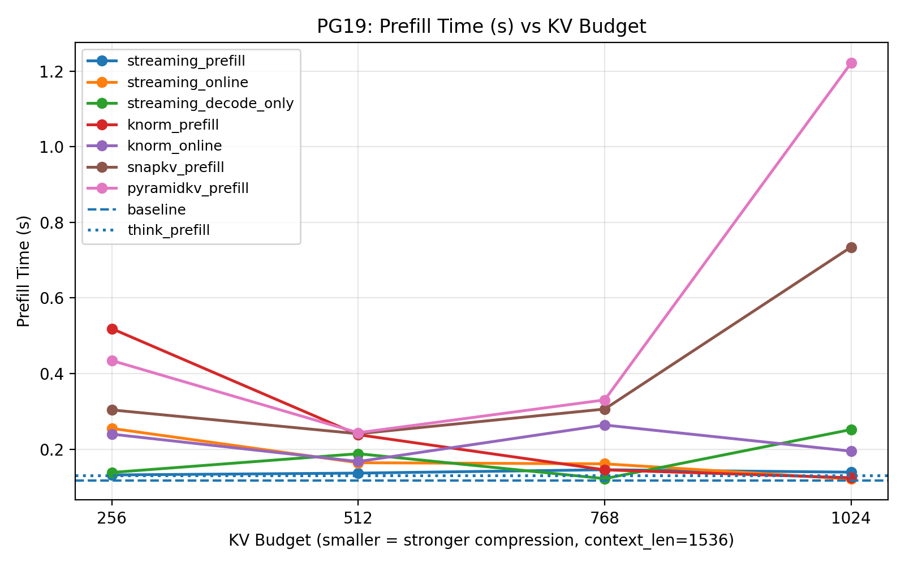
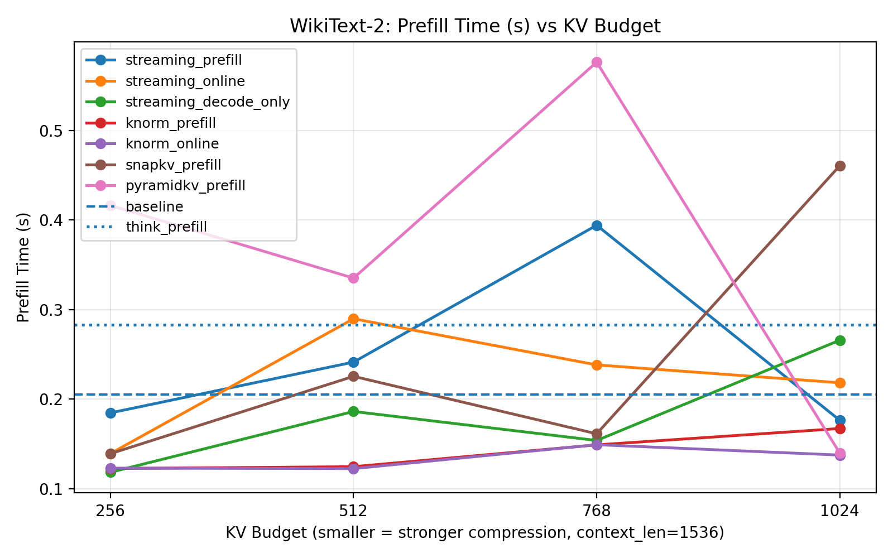
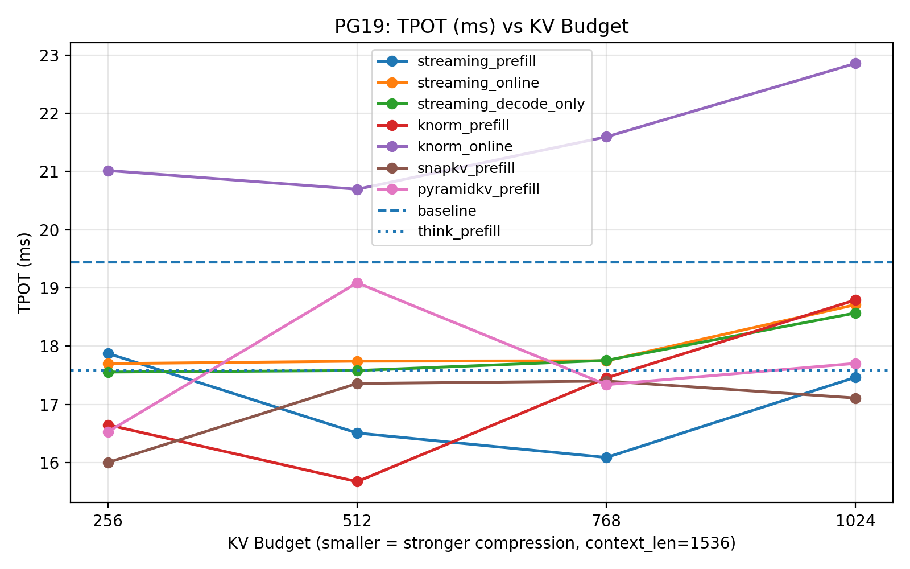
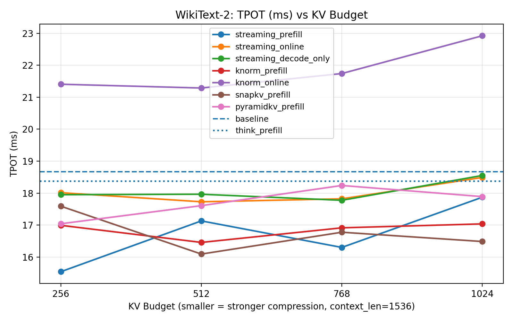
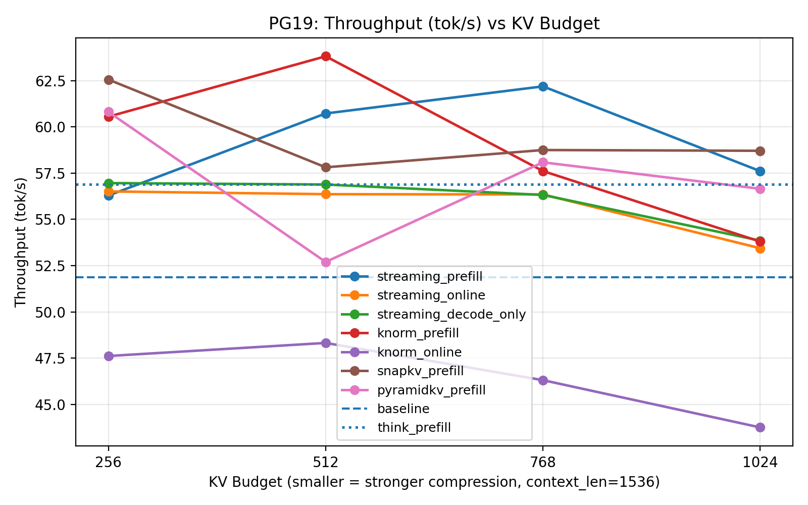
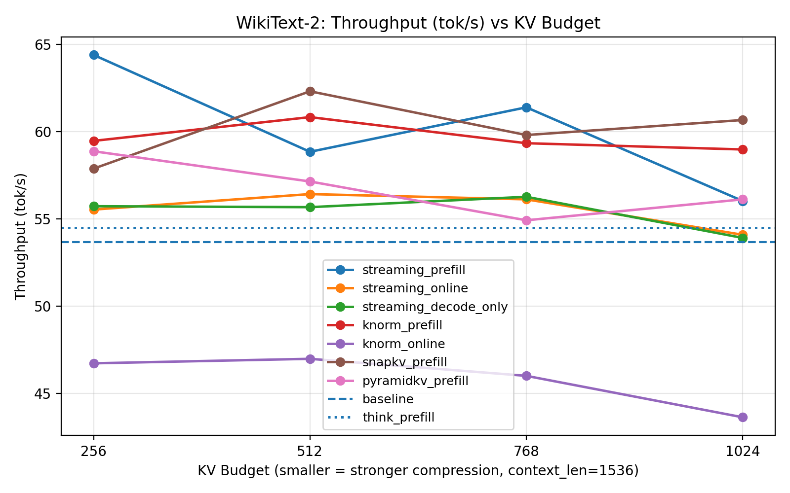
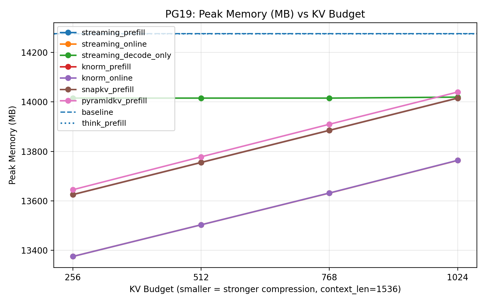
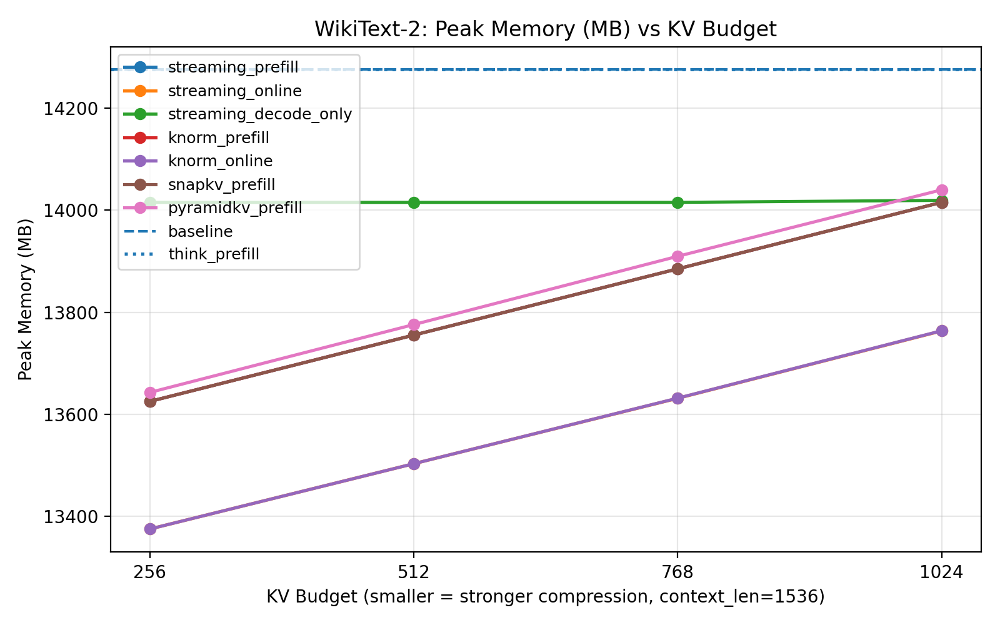

# Efficient-LLM-Inference —— NLP Homework

A lightweight KV cache compression benchmark framework for **Pythia-70M**.

This project implements several training-free KV cache compression / optimization methods and evaluates them on PG-19 and WikiText-2. The evaluation includes perplexity, prefill time, decoding latency, throughput, GPU memory, and KV cache length statistics.

## 1. Project Overview

Large language models store key-value states during inference to avoid recomputing previous tokens. However, for long-context inference, the KV cache can become large and slow down decoding. This project implements and compares several KV cache compression methods on **Pythia-70M**.

Implemented methods:

- **Baseline**
  - No KV cache compression.

- **StreamingLLM**
  - Keeps several initial sink tokens and the most recent tokens.
  - Implemented variants:
    - `streaming_prefill`
    - `streaming_online`
    - `streaming_decode_only`

- **KNorm**
  - A simple key-norm based KV selection heuristic.
  - Implemented variants:
    - `knorm_prefill`
    - `knorm_online`

- **SnapKV**
  - Uses the attention pattern of the recent observation window to score and keep important KV tokens.
  - Implemented as:
    - `snapkv_prefill`

- **PyramidKV**
  - Uses SnapKV-style scoring with layer-wise pyramid budget allocation.
  - Lower layers keep more KV tokens and higher layers keep fewer KV tokens.
  - Implemented as:
    - `pyramidkv_prefill`

- **ThinK**
  - Implemented as a ThinK-inspired key-channel masking method.
  - It zeros out low-importance key channels but keeps the dense KV tensor shape unchanged.
  - Therefore, this implementation affects PPL but does not reduce actual memory.
  - Implemented as:
    - `think_prefill`

### Prefill and Decode Stages

In this project, inference is divided into two stages:

- **Prefill stage**:
  - The model processes the input context tokens.
  - The initial KV cache is built.
  - Prefill compression methods apply KV compression after this stage.

- **Decode stage**:
  - The model processes one token at a time using the existing KV cache.
  - Online methods continue to update and compress the cache during decoding.
  - Prefill-only methods do not compress again during decoding; they only append new KV tokens.

### Position ID Handling

For compressed KV cache methods, the retained keys keep their original RoPE positions. During the target/decode stage, this project manually uses absolute position ids:

```text
position_id = context_len + step
```

Key rerotation / RoPE position remapping is not implemented.

## 2. Environment Setup

### Install Dependencies

```bash
pip install -r requirements.txt
pip install -e .
```


### Download Model and Datasets

```bash
hf download EleutherAI/pythia-70m --local-dir ./pythia-70m
python data/download_dataset.py
```

Expected dataset paths:

```text
data/PG-19/Reminiscences_of_Pioneer_Days_in_St._Paul_by_Frank_Moore.txt
data/WikiText-2/test.txt
```

## 3. Run the Code

### Run a Single Experiment

Example: run SnapKV on PG-19 with budget 512.

```bash
python run_eval.py \
  --model_name ./pythia-70m \
  --dataset pg19 \
  --method snapkv_prefill \
  --context_len 1536 \
  --target_len 512 \
  --budget 512 \
  --output_csv results/all_methods.csv
```

Example: run StreamingLLM online mode.

```bash
python run_eval.py \
  --model_name ./pythia-70m \
  --dataset pg19 \
  --method streaming_online \
  --context_len 1536 \
  --target_len 512 \
  --budget 512 \
  --output_csv results/all_methods.csv
```

Example: run ThinK channel masking.

```bash
python run_eval.py \
  --model_name ./pythia-70m \
  --dataset pg19 \
  --method think_prefill \
  --context_len 1536 \
  --target_len 512 \
  --budget 0 \
  --output_csv results/all_methods.csv
```

### Run All Experiments

```bash
bash scripts/run_all_methods.sh
```

## 4. Evaluation

The main experiment uses:

```text
model       = Pythia-70M
context_len = 1536
target_len  = 512
total tokens = 2048
```

For each sample window:

1. The first `context_len` tokens are used for context prefill.
2. The KV cache is compressed depending on the selected method.
3. The next `target_len` tokens are evaluated using teacher forcing.
4. At step `i`, the model receives ground-truth token `target[i]` and predicts `target[i+1]`.
5. Perplexity is computed as:

```text
PPL = exp(mean cross entropy)
```

The PPL evaluation does **not** use `model.generate()`.

## 5. Metrics

The benchmark reports:

* **PPL**

  * Teacher-forced continuation perplexity.

* **TTFT / prefill_time_s**

  * In this project, `ttft_s` is best interpreted as prefill time or TTFT proxy.
  * It measures context prefill time including prefill compression if used.

* **TPOT**

  * Time per output token.
  * Measured as the average time of each target decoding step.

* **Throughput**

  * Target decoding tokens per second.

* **Peak VRAM**

  * Measured with `torch.cuda.max_memory_allocated()`.

* **KV cache length statistics**

  * `prefill_cache_len_avg`
  * `final_cache_len_avg`
  * `prefill_cache_lens`
  * `final_cache_lens`

## 6. Experiment Results

The following figures visualize the evaluation results on PG19 and WikiText-2.  
For each plot, the x-axis is the KV budget. A smaller budget means stronger KV cache compression. Different curves correspond to different compression methods. The dashed horizontal line indicates the baseline without KV compression.

Experiments were conducted on Pythia-70M and Pythia-6.9B. The 70M model was evaluated on an RTX 3050 GPU, while the 6.9B model was evaluated on a single A100 GPU. Due to the relatively small size of Pythia-70M, differences in perplexity (PPL) and memory usage across methods are less pronounced. In contrast, for the larger model, more significant memory savings and potential speed improvements can be observed. Therefore, we only present the results for the 6.9B model here. The complete numerical results can be found in `results_70m/result.md` and `results_6.9b/result.md`.

#### PPL

This figure shows the perplexity of different methods under different KV budgets. Lower PPL is better. `knorm_online` is omitted from this figure because its PPL is much larger than the other methods and would make the plot hard to read.





#### Prefill Time

This figure shows the time spent in the prefill stage. For prefill-only methods such as SnapKV and PyramidKV, this includes the cost of prefill compression.




#### TPOT

This figure shows the average time per output token during the teacher-forced decoding stage. Lower TPOT means faster per-token decoding.




#### Throughput

This figure shows the decoding throughput in tokens per second. Higher throughput is better.



#### Peak Memory

This figure shows the peak GPU memory usage during evaluation. Lower peak memory indicates better memory efficiency.




---

## 7. Analysis

### KV Cache Reduction

The implemented compression methods successfully reduce the effective KV cache length.

Prefill-only methods compress the context KV cache after the prefill stage. During decoding, new KV tokens are appended normally, so the final cache length becomes larger than the initial budget but is still smaller than the uncompressed baseline.

Online methods maintain a fixed-size KV cache during decoding. Therefore, they provide stronger cache length control than prefill-only methods.

PyramidKV uses layer-wise budget allocation. Lower layers keep more KV tokens, while higher layers keep fewer tokens. This makes its per-layer cache lengths different from methods such as StreamingLLM, KNorm, and SnapKV.

### PPL

The PPL results show that most compression methods can preserve language modeling quality close to the baseline.

Overall, the PPL trend is approximately:

```text
baseline < PyramidKV < SnapKV < StreamingLLM < KNorm_prefill < thinK < KNorm_online
```

This means that the baseline has the best PPL because it keeps the full KV cache. Among the compressed methods, SnapKV and PyramidKV generally preserve PPL better than StreamingLLM and KNorm.

SnapKV uses recent attention patterns to select important KV tokens, while PyramidKV further applies layer-wise budget allocation. These attention-based methods are more effective than simple heuristic selection.

StreamingLLM also keeps PPL reasonably close to the baseline, especially when the budget is not too small. It is simple and stable because it keeps sink tokens and recent tokens.

KNorm prefill works as a lightweight heuristic baseline, but its PPL is worse than attention-based methods. KNorm online performs poorly and is not shown in the PPL figure because its value is much larger. This suggests that repeatedly reselecting KV tokens during decoding can make the cache unstable.

ThinK affects PPL because it masks key channels, but it does not reduce cache length in this implementation.

### Memory

All token-level KV compression methods reduce memory usage compared with the baseline.

The overall peak memory trend is approximately:
```text
baseline = ThinK > StreamingLLM > PyramidKV > SnapKV > KNorm
```

This shows that KV compression provides clear memory optimization. Methods with smaller effective KV cache lengths usually have lower memory usage.

However, peak memory does not only come from the final KV cache. It also includes model weights, temporary activations, intermediate tensors, and CUDA memory allocation behavior. Therefore, peak memory is not always perfectly proportional to the final cache length.

For online methods, the final cache length can be much smaller than prefill-only methods, but peak memory may still be affected by the prefill stage because the model first processes the full context before compression is applied.

ThinK does not reduce memory in this implementation because it keeps the dense KV tensor shape unchanged and only masks key channels.


### Runtime

The runtime results show that KV compression can provide some decoding speedup, but the measured speedup is not perfectly stable.

In theory, PG19 and WikiText-2 should have similar prefill time when the model, context length, and target length are the same. However, the measured wall-clock time can still differ because of GPU scheduling, CUDA kernel launch overhead, memory allocation, warmup effects, and system load.

## 8. Project Structure

```text
.
├── pythia_kvpress
│   ├── __init__.py
│   ├── hooks.py                 # attention hook registration
│   ├── cache_utils.py           # DynamicCache read/write helpers
│   ├── presses
│   │   ├── __init__.py
│   │   ├── base.py              # BasePress
│   │   ├── scorer.py            # score-based pruning base class
│   │   ├── streaming.py         # StreamingLLM
│   │   ├── knorm.py             # KNorm
│   │   ├── snapkv.py            # SnapKV
│   │   ├── pyramidkv.py         # PyramidKV
│   │   └── think.py             # ThinK-inspired key-channel masking
│   └── eval
│       ├── __init__.py
│       └── ppl.py               # teacher-forced PPL evaluation
├── run_eval.py                  # single experiment entry point
├── scripts
│   └── run_all_methods.sh       # full benchmark script
├── tests                        # unit and visualization tests
└── results                      # CSV results and summaries
```

## 9. Limitations

* The model is Pythia-70M, so latency speedups are noisy.
* The implementation uses Python hooks instead of optimized CUDA kernels.
* ThinK is implemented as channel masking and does not reduce real memory.
* Key rerotation / RoPE position remapping is not implemented.
* PG-19 uses a single long-text sample/window by default.


